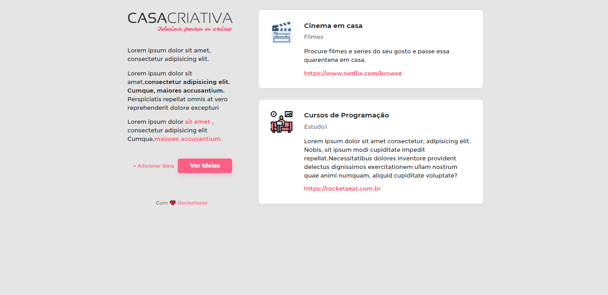
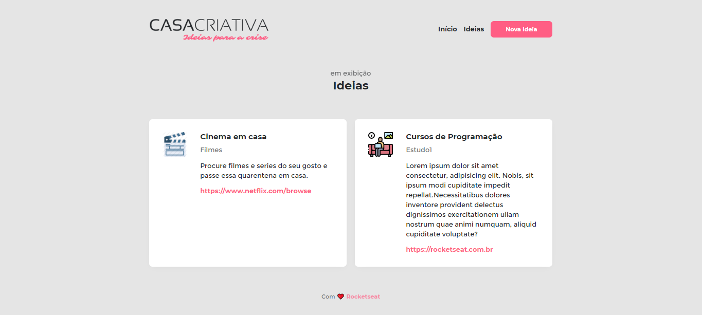
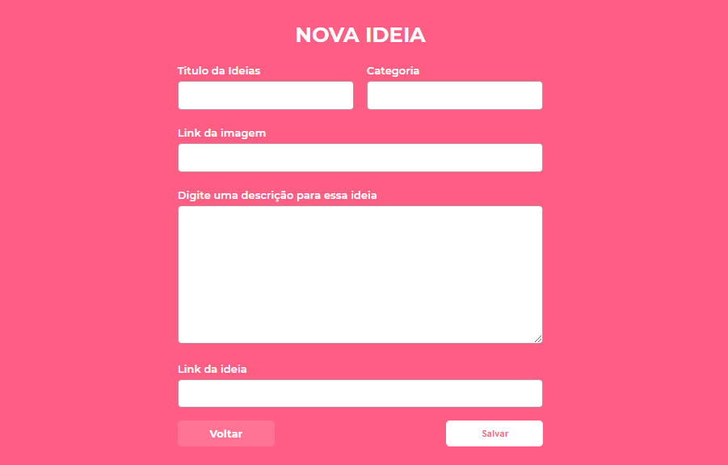

 <h1 align="center">Controle de academia</h1>
<h1 align="center">
    
</h1>

<h3 align="center">
  WorkShopDev
</h3>

 Projeto criado com node.js, JavaScript, Nunjucks, Banco de dados: Sqlite.

<blockquote align="center">“Sua única limitação é você mesmo”!</blockquote>

  
 ## 🚀 Desafios

     
   
  
   
   
  
   
   
  
   
   

